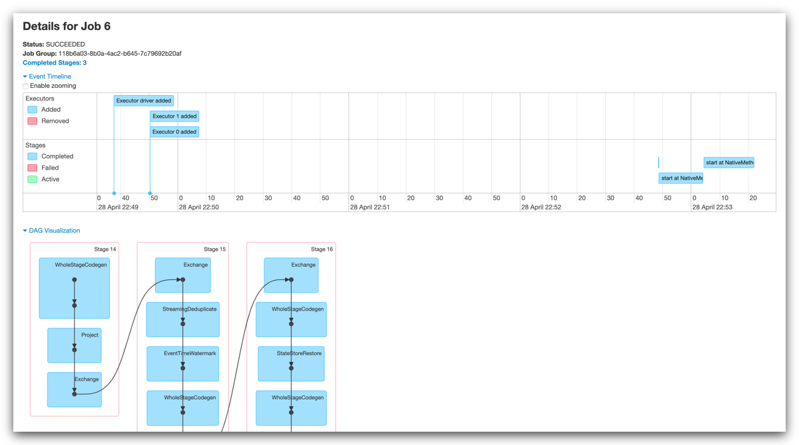

# SF Crime Statistics with Spark Streaming

In this project, we will be provided with a real-world dataset, extracted from Kaggle, on San Francisco crime incidents, and you will provide statistical analyses of the data using Apache Spark Structured Streaming.

## Table of contents

- [Structure](#structure)
- [Requirements](#requirements)
- [Getting started](#getting-started)
  - [Cloning the repository](#cloning-the-repository)
  - [Terminal 1: Architecture](#terminal-1-architecture)
  - [Terminal 2: Producer](#terminal-2-producer)
  - [Terminal 3: Consumer](#terminal-3-consumer)
  - [Screenshots](#screenshots)
- [Stopping the solution](#stopping-the-solution)

---

## Structure<a name="structure"></a>

This tree shows the repository structure.

```
.
├── docker
│   ├── producer
│   │   └── Dockerfile
│   └── spark
│       └── Dockerfile
├── images
│   ├── architecture.png
│   ├── iterm.jpg
│   ├── query.png
│   ├── spark-job-dag.png
│   ├── spark-jobs.png
│   └── spark-nodes.png
├── src
│   ├── config
│   │   ├── config.ini
│   │   └── logging.ini
│   ├── data
│   │   ├── police-department-calls-for-service.json
│   │   └── radio_code.json
│   ├── config.py
│   ├── consumer_server.py
│   ├── data_stream.py
│   ├── kafka_server.py
│   ├── logger.py
│   └── producer_server.py
├── .editorconfig
├── .gitignore
├── docker-compose.yaml
├── README.md
├── run_consumer.sh
└── run_producer.sh
```

---

## Requirements<a name="requirements"></a>

The application we're building is quite memory and CPU demanding, so you must æhave a decent computer with at least **16GB RAM** and **4-core CPU**.

All the services and frameworks we need will to run the application are containerized, so the only tool you must have propery installed is Docker Engine / Desktop + Docker Compose.

---

## Getting started<a name="getting-started"></a>

We will need multiple terminal sessions in order to run the application:

- A session to run the architecture of the solution, consisting in:
  - Apache Zookeeper
  - A 2-node Apache Kafka cluster
  - A 3-node Apache Spark cluster
- A session to run the simulator that produces the events
- A session to run the server that consumes these events


This image shows how the container architecture is deployed. Let's go to run this all!

### Cloning the repository<a name="cloning-the-repository"></a>

The first step is to clone this repository. Just type the following command in your terminal:

```bash
# Clone the repository...
$ git clone https://github.com/vermicida/data-streaming-spark.git

# ...and move to its directory
$ cd data-streaming-spark
```

### Terminal 1: Architecture<a name="terminal-1-architecture"></a>

Open a new terminal session, or use the one you just used to clone the respository. From the root folder of the project, run the following command:

```bash
$ docker-compose up --force-recreate --build
```

Docker will run the services defined in the file `docker-compose.yaml`. If any of the images isn't found locally, Docker will download it. This process take awhile, so be patient; 10-15 minutes based on your internet connection and hardware.

### Terminal 2: Producer<a name="terminal-2-producer"></a>

Once the architecture is ready, we can run the producer. The code is hosted inside a container called `producer`, so we can run a command within that container in order to start the producer.

The command is wrapped in a script file to ease the task. Open a new terminal session and run the command below:

```bash
$ ./run_producer.sh
```

It instantiate a `KafkaProducer` that will be pushing a new message to the Kafka's cluster every 2 seconds.

### Terminal 3: Consumer<a name="terminal-3-consumer"></a>

Now we can start our consumer. Just as we did with the producer, we will run a script that submits the consumer application to the Spark's cluster for us. In this case, the code is hosted inside the Spark's master node container.

Type command in a new terminal sessión:

```bash
$ ./run_consumer.sh
```

In a few seconds, the consumer application will start processing the messages from the Kafka topic in small batches (windowed).

### Screenshots<a name="screenshots"></a>

Below are some screenshots of the application and its monitoring.


Once the consumer is running, we can navigate `http://localhost:8080` in a web browser to see Spark UI. This console shows tons of info regarding the jobs running in the cluster.

Here you can check out the nodes of the cluster:


Click on an application to see their jobs:


Also you can get details of every single job, such as its DAG or its logs:



And last but not least, a closer view of the terminal where Spark prints the aggregate table we're building, updated after every batch processed.


Everything works like a charm!

---

## Stopping the solution<a name="stopping-the-solution"></a>

To stop all the running processes we will go in reverse order:

- In **Terminal 3**, hit `Ctrl` + `C`.
- In **Terminal 2**, hit `Ctrl` + `C`.
- In **Terminal 1**, hit `Ctrl` + `C`. When Docker Compose stops all the services, make sure to also remove the containers running the following command:

```bash
$ docker-compose down
```
