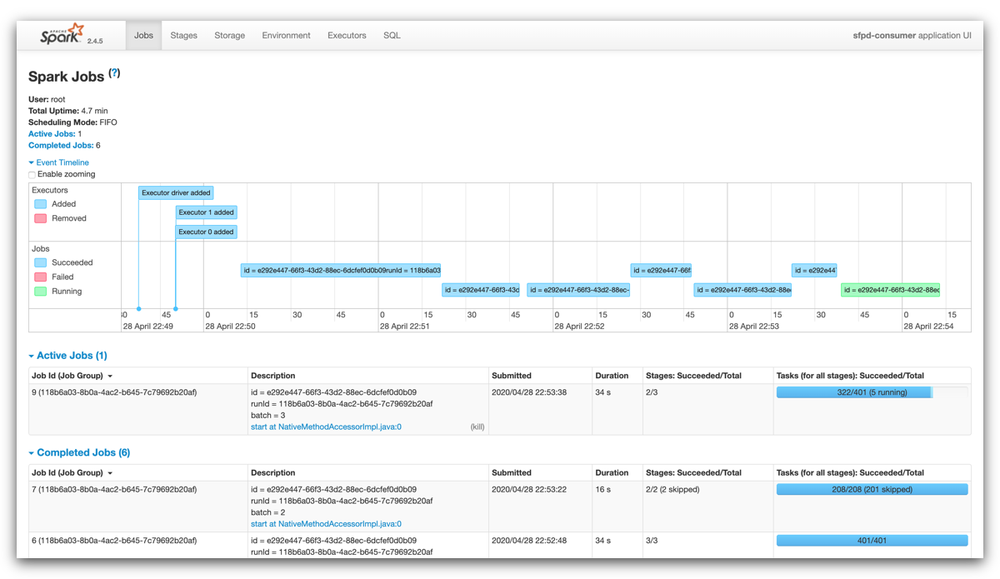

# San Francisco crime incidents

## Using Apache Spark Structured Streaming

TBD

## Table of contents

- [Structure](#structure)
- [Requirements](#requirements)
  - [Cloning the repository](#cloning-the-repository)
  - [Preparing the environment](#preparing-the-environment)
    - [Terminal 1: Architecture](#terminal-1-architecture)
    - [Terminal 2: Producer](#terminal-2-producer)
    - [Terminal 3: Stream Processor](#terminal-3-stream-processor)
    - [Terminal 4: Consumer](#terminal-4-consumer)
- [How to use](#how-to-use)
  - [Stopping the solution](#stopping-the-solution)

---

## Structure<a name="structure"></a>

This tree shows the repository structure.

```
.
├── docker
│   ├── producer
│   │   └── Dockerfile
│   └── spark
│       └── Dockerfile
├── images
│   ├── architecture.png
│   ├── iterm.jpg
│   ├── query.png
│   ├── spark-job-dag.png
│   ├── spark-jobs.png
│   └── spark-nodes.png
├── src
│   ├── config
│   │   ├── config.ini
│   │   └── logging.ini
│   ├── data
│   │   ├── police-department-calls-for-service.json
│   │   └── radio_code.json
│   ├── config.py
│   ├── consumer_server.py
│   ├── data_stream.py
│   ├── kafka_server.py
│   ├── logger.py
│   └── producer_server.py
├── .editorconfig
├── .gitignore
├── docker-compose.yaml
├── README.md
├── run_consumer.sh
└── run_producer.sh
```

---

## Requirements<a name="requirements"></a>

TBD

### Cloning the repository<a name="cloning-the-repository"></a>

The first step is to clone this repository. Just type the following command in your terminal:

```bash
# Clone the repository...
$ git clone https://github.com/vermicida/data-streaming-spark.git

# ...and move to its directory
$ cd data-streaming-spark
```

### Preparing the environment<a name="preparing-the-environment"></a>

We need multiple terminal sessions in order to run the project:

- A session to to run the architecture of the solution, consisting in:
  - A Zookeeper ensemble
  - A 2-node Apache Kafka cluster
  - A 3-node Apache Spark cluster
- A session to run the simulator that produces events randomly
- A session to run the server that consumes these events


#### Terminal 1: Architecture<a name="terminal-1-architecture"></a>

Open a new terminal session, or use the one you just used to clone the respository. From the root folder of the project, run the following command:

```bash
$ docker-compose up --force-recreate --build
```

Docker will run the services defined in the file `docker-compose.yaml`. If any of the images isn't found locally, Docker will download it. This process take awhile, so be patient; 5-10 minutes based on your internet connection and hardware.

#### Terminal 2: Producer<a name="terminal-2-producer"></a>

TBD

#### Terminal 3: Consumer<a name="terminal-4-consumer"></a>

TBD

---

## How to use<a name="how-to-use"></a>


Once the consumer is running, we can navigate `http://localhost:8080` in a web browser to see Spark UI. This console shows tons of info regarding the jobs running in the cluster.

Here you can check out the nodes of the cluster:


Click on an application to see their jobs:



Also you can get details of every single job, such as its DAG or its logs:


And last but not least, a closer view of the terminal where Spark prints the aggregate table we're building, updated after every batch processed.


Everything works like a charm!

### Stopping the solution<a name="stopping-the-solution"></a>

To stop all the running processes we will go in reverse order:

- In **Terminal 3**, hit `Ctrl` + `C`.
- In **Terminal 2**, hit `Ctrl` + `C`.
- In **Terminal 1**, hit `Ctrl` + `C`. When Docker Compose stops all the services, make sure to also remove the containers running the following command:

```bash
$ docker-compose down
```
